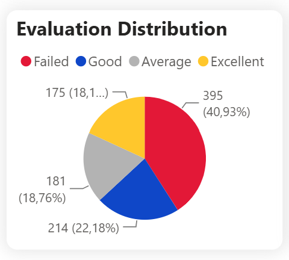
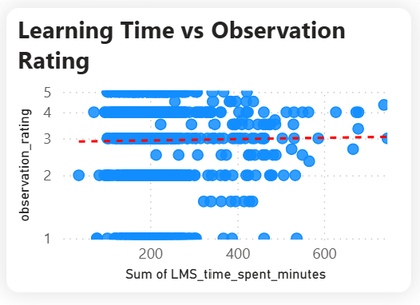
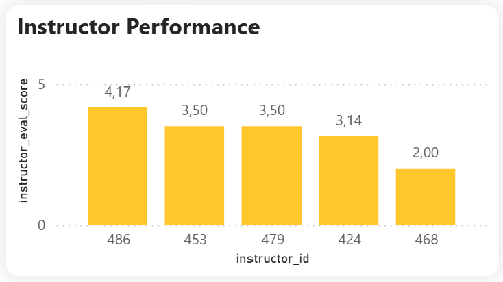
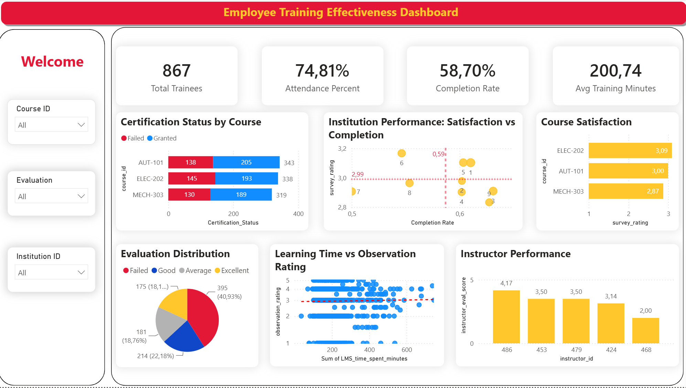

# L-D-Performance-Training
This project is an end-to-end Data Analytics solution designed to support the L&amp;D Department in tracking, analyzing, and optimizing internal training programs. The interactive dashboard provides actionable insights into employee participation, course completion rates, and instructor performance.
# 📊 L&D Performance & Training Effectiveness Dashboard

## Business Problem

Organizations invest significant budgets in employee training, yet training managers often struggle to answer questions such as:

- Which courses perform best?
- Which institutions deliver the highest learning quality?
- Are learners spending enough time on the LMS?
- Does more learning time actually improve performance?
- Which instructors require additional coaching?
- What factors contribute to certification success?

This dashboard addresses these questions by transforming learning records into business-oriented KPIs and visual insights.

## 🛠️ Tech Stack & Tools Used
* **Data Processing (ETL):** Microsoft Excel (Power Query, Pivot Tables, Advanced Data Formulas).
* **Data Visualization & Modeling:** Power BI (DAX, Interactive Dashboards).

## Data Dictionary

| Column | Description |
|---------|-------------|
| institution_id | Unique identifier of the training institution |
| course_id | Training course identifier |
| student_id | Unique learner identifier |
| instructor_id | Instructor responsible for the course |
| LMS_time_spent_minutes | Total time spent on the Learning Management System (minutes) |
| LMS_logins | Number of LMS login sessions |
| attendance_percent | Percentage of attendance |
| assignments_submitted | Number of assignments submitted |
| survey_rating | Learner satisfaction rating (1–5) |
| observation_rating | Practical observation score (1–5) |
| instructor_eval_score | Instructor evaluation score |
| feedback_text | Student written feedback |
| target_quality_label | Target quality classification used for analysis |

## Data Preparation

The dataset was prepared using Power Query before loading into Power BI.

Key preparation steps included:

- Promoted the first row as headers.
- Converted data types using locale settings.
- Rounded numerical values where appropriate.
- Standardized column data types.
- Created a derived business field (`Certification_Status`) based on Observation Rating.
- Reordered columns.
- Renamed columns for reporting consistency.

## 🚀 Key Features & Responsibilities
* **Data Cleaning & Exploratory Analysis:** Sourced raw vocational training feedback dataset from Kaggle. Cleansed and standardized the data using Excel Power Query. Utilized Pivot Tables to conduct initial Exploratory Data Analysis (EDA), summarize metric distributions, and validate data accuracy prior to building the Data Model in Power BI.
* **Comprehensive KPI Tracking:** Engineered dynamic DAX measures to track critical L&D metrics, including Total Enrollments, Attendance Rate, Completion Rate, and Average Training Minutes.
* **Instructor & Course Evaluation:** Developed visual analyses to evaluate instructor effectiveness and course satisfaction based on post-training survey ratings.
* **Interactive Navigation:** Implemented a Z-pattern layout with dynamic slicers (Course ID, Evaluation, Institution ID) for an intuitive data exploration experience.

## 📗 Data Validation & Exploratory Data Analysis (Excel Pivot Table)
*   **Certification Rate by Course:** Summarized the distribution of evaluation outcomes (Failed, Average, Good, Excellent) and total student counts for core courses like AUT-101, ELEC-202, and MECH-303. This table quickly surfaced the critical 41.30% overall failure rate, establishing the baseline for identifying systemic L&D issues prior to data visualization.
*   **Instructor Performance Assessment:** Cross-tabulated `Instructor_id` with average survey ratings and instructor evaluation scores, dynamically segmented by the courses they teach. This matrix was engineered to isolate human-factor variables and detect early variances in teaching quality across the faculty.
*   **Detailed Learning Performance:** Aggregated trainee-level engagement metrics—including sum of LMS logins, time spent in minutes, attendance percentage, and observation ratings—grouped by `Student_id` with dynamic filtering by `course_id`. This structured view served as the crucial data validation step before analyzing the correlation between theoretical study time and practical competency.

## 💡 Key Business Insights
1. **Certification Status by Course:** The difference between the courses is not significant. This suggests that the completion issue might not stem from a single course, but rather is more systemic.

2. **Institution Performance (Satisfaction vs. Completion):** 
* **Non-Linear Relationship:** There is no clear correlation between course completion rates and user satisfaction. High completion does not guarantee high satisfaction (e.g., Institutions 3, 4, 9), indicating that completion might be driven by compliance rather than content quality.
* **Lack of Absolute Outliers:** No single institution demonstrates absolute superiority across both metrics. The performance is generally clustered around the median.
* **Top Performers:** Institutions 1 and 5 are the most balanced branches, landing in the top-right quadrant. However, they only perform slightly above the systemic average (Completion ~58.70%, Satisfaction ~2.99), suggesting that there is still significant room for system-wide L&D optimization.

  

3. **Course Satisfaction Insights:** The satisfaction ratings across all courses are tightly clustered around the 3.0 mark, with a very narrow margin between the highest (`ELEC-202` at 3.09) and the lowest (`MECH-303` at 2.87). This indicates a generally neutral reception and suggests that the overall training delivery method is consistent, without any extreme outliers polarizing the trainees.

4. **Evaluation Distribution:** The most alarming metric within the distribution is the 'Failed' segment, which accounts for the largest single proportion at nearly 41% (395 trainees). This unusually high failure rate signals a critical systemic misalignment—whether it be unrealistic course difficulty, inadequate training delivery, or a flawed testing mechanism—requiring immediate investigation by the L&D department.

5. **Learning Time vs Observation Rating:** 
* The near-horizontal trendline clearly indicates that there is no clear relationship visible in the current data between the total time spent on the LMS and the actual practical observation rating. An employee logging 600+ minutes does not inherently perform better on the floor than one logging 150 minutes.
* This suggests that training effectiveness depends on additional factors beyond time spent, such as instructional quality, learner engagement, or course design.
* Learning time does not appear to be the primary driver of training outcomes. Therefore, increasing learning hours alone may not be the most effective strategy for improving performance.
  
  

6. **Instructor Performance:**  
* Instructor 486 clearly leads with 4.17/5.
* Instructor 468 is the lowest, at only 2.00/5.
* The gap between the highest and lowest is 2.17 points, which is quite significant.
* Instructor performance has a higher degree of polarization/variance than course satisfaction and institution satisfaction.

This is a strong indication that the instructor might be a major factor influencing the overall training experience.
  

## Dashboard Preview
You can download the `.pbix` file included in this repository to interact with the raw data model in Power BI Desktop, or review the static overview in the attached `L&D Performance & Training Dashboard.pdf`.



## 📂 Repository Structure

```text
L-D-Performance-Training/
│
├── Dashboard/      # Contains the interactive Power BI dashboard file (.pbix)
├── Data/           # Contains the raw and processed datasets
├── Excel/          # Contains the Excel files for ETL (Power Query) and EDA (Pivot Tables)
├── Images/         # Stores all screenshots and visual assets used in the README
└── README.md       # Main project documentation and business insights
---
*Designed and developed by **Mai Quoc Bao** - Information Systems Student.*
