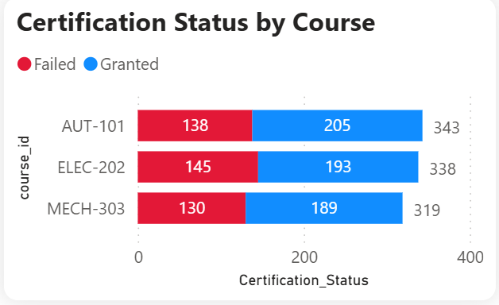
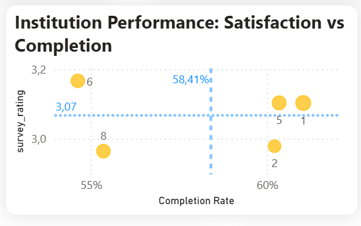
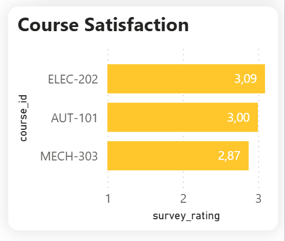

# L-D-Performance-Training
This project is an end-to-end Data Analytics solution designed to support the L&amp;D Department in tracking, analyzing, and optimizing internal training programs. The interactive dashboard provides actionable insights into employee participation, course completion rates, and instructor performance.
# 📊 L&D Performance & Training Effectiveness Dashboard

## 🛠️ Tech Stack & Tools Used
* **Data Processing (ETL):** Microsoft Excel (Power Query, Pivot Tables, Advanced Data Formulas).
* **Data Visualization & Modeling:** Power BI (DAX, Interactive Dashboards).

## 🚀 Key Features & Responsibilities
* **Data Cleaning & Exploratory Analysis:** Sourced raw vocational training feedback dataset from Kaggle. Cleansed and standardized the data using Excel Power Query. Utilized Pivot Tables to conduct initial Exploratory Data Analysis (EDA), summarize metric distributions, and validate data accuracy prior to building the Data Model in Power BI.
* **Comprehensive KPI Tracking:** Engineered dynamic DAX measures to track critical L&D metrics, including Total Enrollments, Attendance Rate, Completion Rate, and Average Training Minutes.
* **Instructor & Course Evaluation:** Developed visual analyses to evaluate instructor effectiveness and course satisfaction based on post-training survey ratings.
* **Interactive Navigation:** Implemented a Z-pattern layout with dynamic slicers (Course ID, Evaluation, Institution ID) for an intuitive data exploration experience.

## 💡 Key Business Insights
1. **Certification Status by Course:** The difference between the courses is not significant. This suggests that the completion issue might not stem from a single course, but rather is more systemic.

2. **Institution Performance (Satisfaction vs. Completion):** 
* **Non-Linear Relationship:** There is no clear correlation between course completion rates and user satisfaction. High completion does not guarantee high satisfaction (e.g., Institutions 3, 4, 9), indicating that completion might be driven by compliance rather than content quality.
* **Lack of Absolute Outliers:** No single institution demonstrates absolute superiority across both metrics. The performance is generally clustered around the median.
* **Top Performers:** Institutions 1 and 5 are the most balanced branches, landing in the top-right quadrant. However, they only perform slightly above the systemic average (Completion ~58.70%, Satisfaction ~2.99), suggesting that there is still significant room for system-wide L&D optimization.

3. **Course Satisfaction Insights:** The satisfaction ratings across all courses are tightly clustered around the 3.0 mark, with a very narrow margin between the highest (`ELEC-202` at 3.09) and the lowest (`MECH-303` at 2.87). This indicates a generally neutral reception and suggests that the overall training delivery method is consistent, without any extreme outliers polarizing the trainees.

## 📸 Dashboard Preview

---
*Designed and developed by **Mai Quoc Bao** - Information Systems Student passionate about HR Analytics, Data Visualization, and Business Intelligence.*
